# UpThrust Affordable Oscilloscope Current Probe (Up-cp0001A)

This project was developed as a part of the **Engineering Design Project** module.

## Project Overview

The UpThrust Affordable Oscilloscope Current Probe provides a cost-effective solution for current measurement using standard oscilloscopes. This device is particularly aimed at students, hobbyists, and entry-level engineers who need to diagnose and troubleshoot electronic circuits without access to expensive laboratory equipment. The project emphasizes affordability while maintaining a high standard of performance for essential functions.

## Problem Description

Many electronics enthusiasts and professionals rely on USB or handheld oscilloscopes. While these oscilloscopes are becoming more accessible, the associated current probes often remain prohibitively expensive, sometimes costing more than the oscilloscope itself. This project addresses the need for an affordable current probe that makes circuit analysis and troubleshooting more accessible.

## Product Features & Specifications

### Key Features:
*   **Cost-effective:** Designed to be a budget-friendly alternative to high-end current probes.
*   **Compact Size:** Approximately 16cm x 13cm.
*   **Good Accuracy:** Capable of measuring current down to milliamperes.
*   **Sufficient Bandwidth:** Measures signals with a bandwidth of up to 80 kHz, with optimal accuracy up to 40 kHz.
*   **Standard Connectivity:** Features a BNC connector for direct connection to most oscilloscopes.
*   **USB Powered:** Conveniently powered via a 5V USB Type-C connection with a low current draw of 20mA.

### Technical Specifications:
*   **Model Number:** Up-cp0001A
*   **Dimensions:** 16cm * 13cm
*   **Material:** PLA (3D printed enclosure)
*   **Frequency Range:** up to 80kHz
*   **Sensitivity:** 200mV/A
*   **Power:** 5V 20mA, Type C USB
*   **Connector:** 1x BNC

---

## Product Architecture
The current probe operates based on a Hall effect sensor. The signal from the sensor passes through a DC Offset Remover, an Amplifier, and a Noise Filter before being sent to the output. The system is powered by a +5V input, which is also used to generate a -5V rail.

  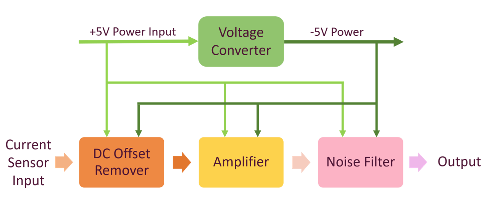

## Schematic Diagram
The electronic schematic for the probe's signal conditioning and filtering circuitry.

  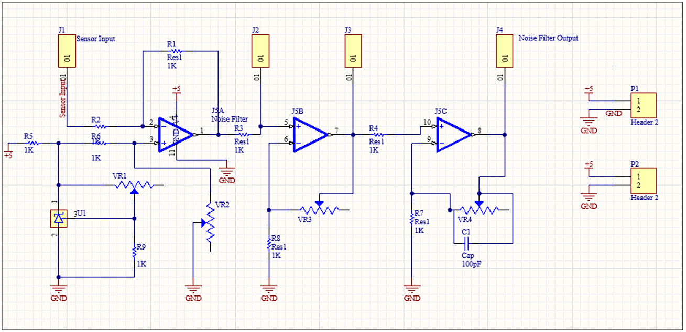

## Enclosure Design
The custom-designed 3D-printed enclosure for the probe.

<table>
  <tr>
    <td align="center">
      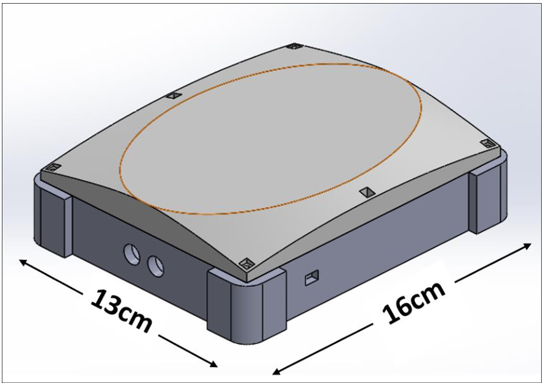 
      <strong>Isometric View</strong>
    </td>
    <td align="center">
      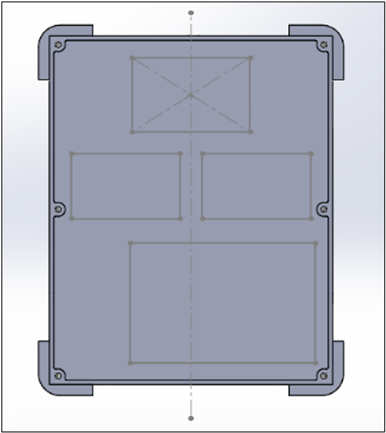 
      <strong>Bottom View</strong>
    </td>
    <td align="center">
      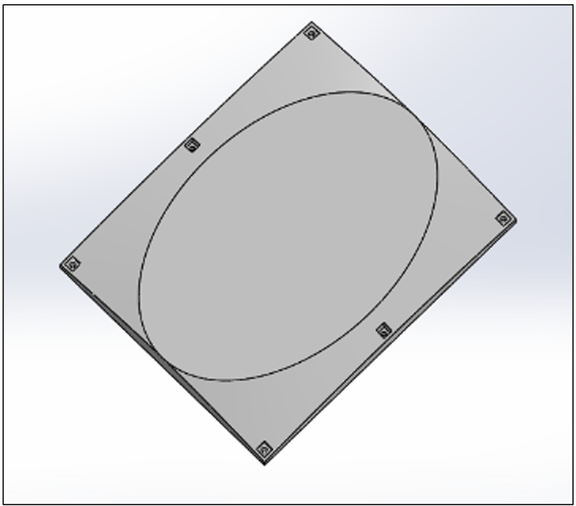 
      <strong>Top View</strong>
    </td>
  </tr>
</table>

## PCB Design
The layout of the Printed Circuit Board (PCB).

<table>
  <tr>
    <td align="center">
      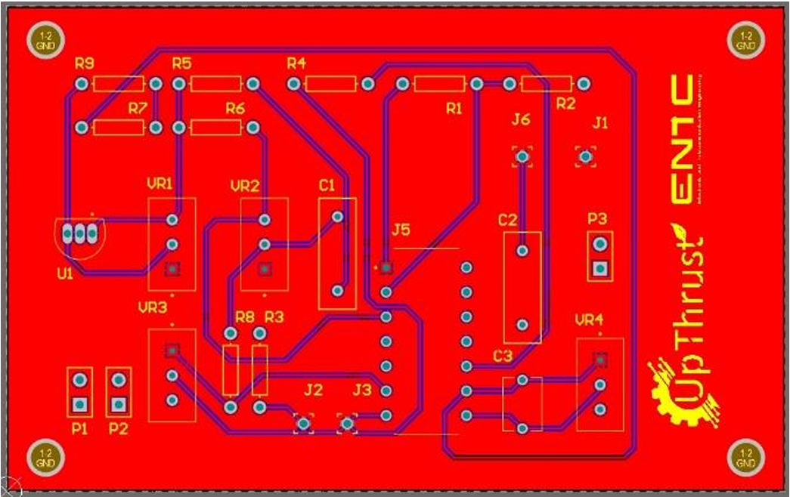 
      <strong>Top Layer</strong>
    </td>
    <td align="center">
      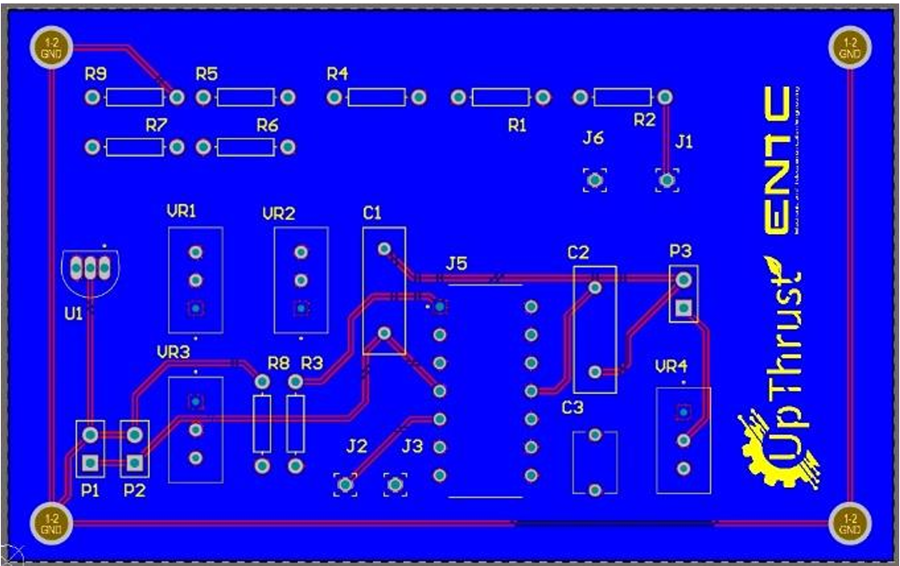 
      <strong>Bottom Layer</strong>
    </td>
    <td align="center">
      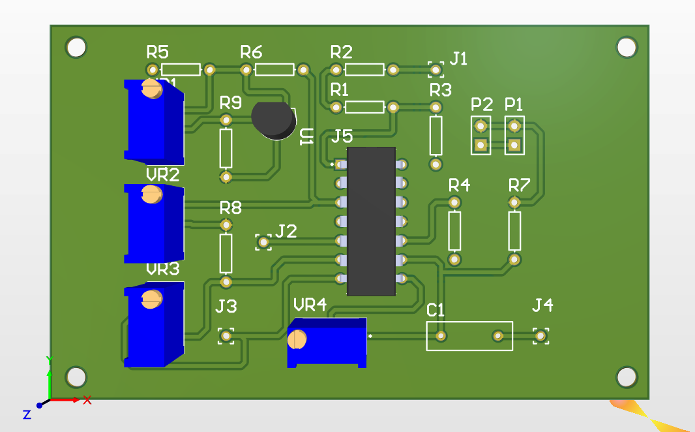 
      <strong>3D Model</strong>
    </td>
  </tr>
</table>

## Test Results
The following image shows the probe's output accurately tracking the actual input signal with varying amplitudes.

    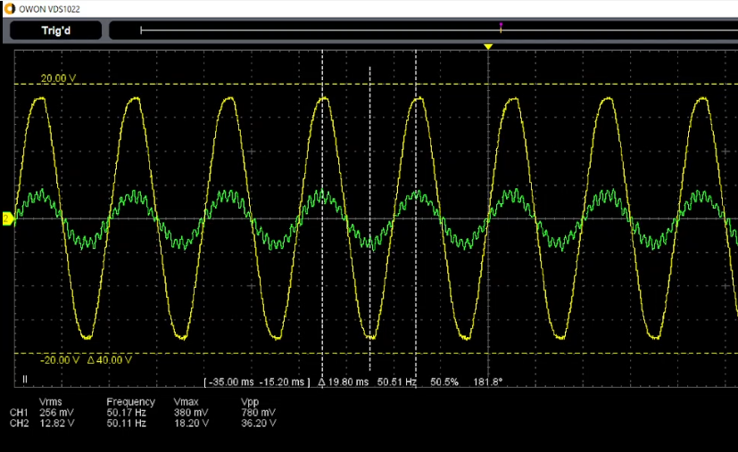
    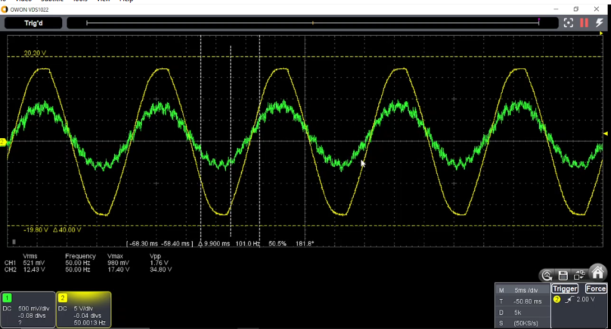

## Final Product
The assembled Up-cp0001A current probe in its packaging.

    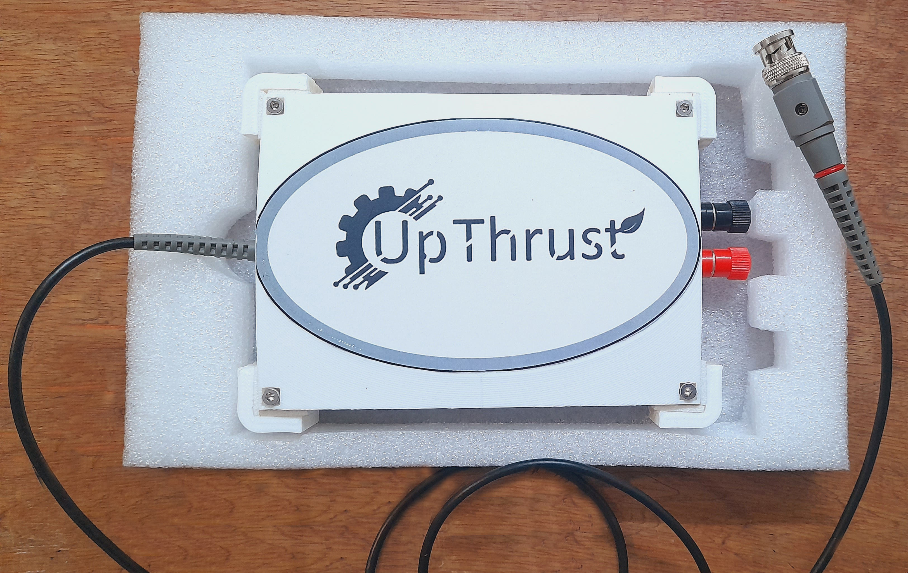

### Internal Structure
A view inside the enclosure showing the placement of the main components, including the PCB, Hall effect sensor, and power converter.

    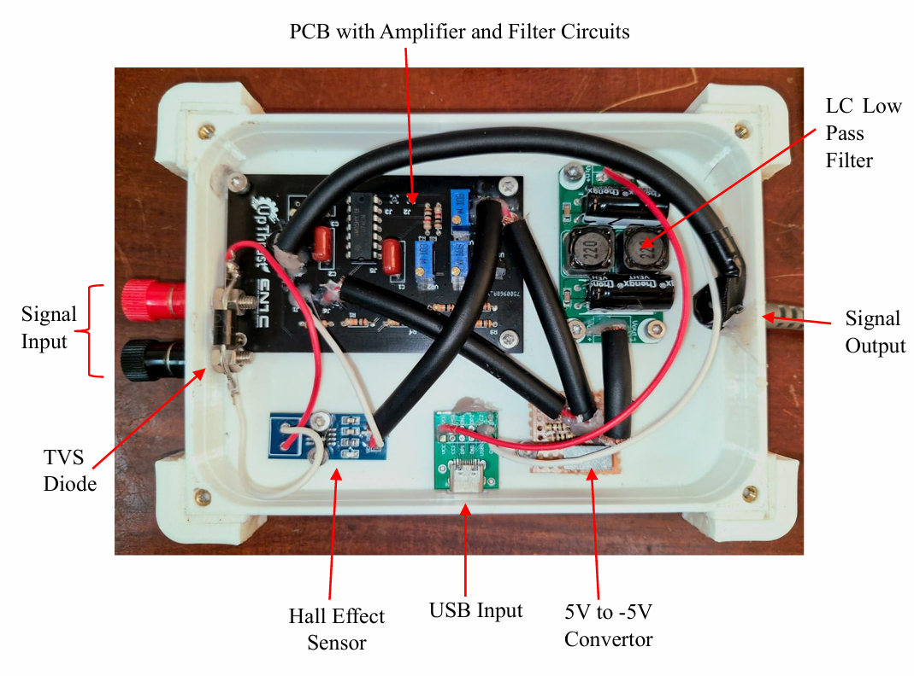

---

## Usage Instructions

1.  **Connect the probes** to the input terminals of the device.

    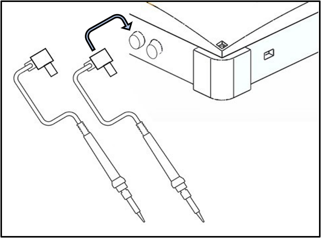

2.  **Connect the USB cable** to the USB-C port for power.

    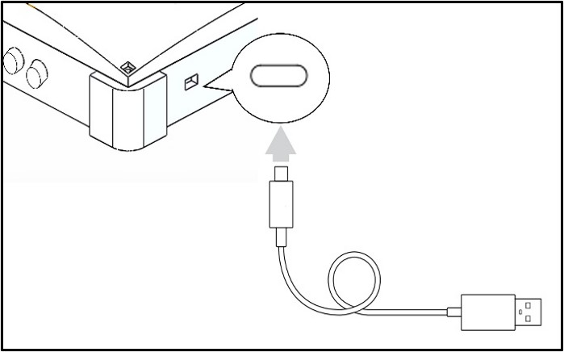

3.  **Connect the BNC connector** to the oscilloscope's input channel.

    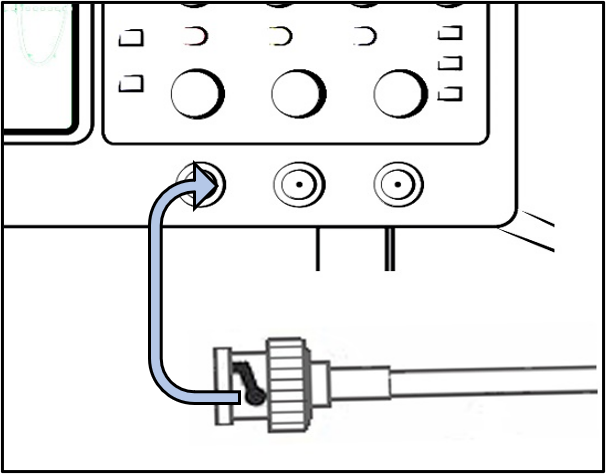

4.  Finally, **place the current probes** at the desired location in your circuit to observe the waveform on the oscilloscope.

## Future Improvements

To enhance the product further, future versions could incorporate a processor to automatically detect the input signal's frequency. This would allow for the dynamic design of a filter with a slightly higher cutoff frequency, resulting in a cleaner and more accurate output signal.
